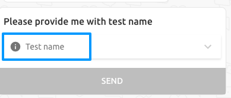

## API Documentation

Chatbot_ner designed to extract essential entities or information like date, time, numbers, texts (city, organisation name) from textual data. These APIs are built keeping in mind to plug it in for conversational AI applications.

Following are the different entity types we currently support. 

| Entity Type                     | Description                                                  | Examples                                                     |
| ------------------------------- | ------------------------------------------------------------ | ------------------------------------------------------------ |
| [Time](#1-time)                 | Detects time in various formats from given text.             | tomorrow morning at 5, कल सुबह ५ बजे, kal subah 5 baje         |
| [Date](#2-date)                 | Detects date in various formats from given text.             | 28-12-2096, 09th Nov 2014, Tomorrow, next monday, agle somvar, अगले सोमवार |
| [Number](#3-number)             | Detects number from the text.                                | 50 rs per person, ५ किलो चावल, मुझे एक लीटर ऑइल चाहिए          |
| [Phone number](#4-phone-number) | Detects phone numbers in given text.                         | +919222222222                                                |
| [Email](#5-email)               | Detects email addresses in given text.                       | abc.123@gmail.com                                            |
| [Text](#6-text)                 | Detect custom entities in text string using full text search in Datastore or based on contextual model | **pizza**, **मुंबई**                                           |
| [PNR-Number](#7-pnr-number)     | Detect PNR (serial) codes in given text.                     | My flight PNR is **4SGX3E**                                  |
| [Regex](#8-regex)               | Detect entities using custom regex patterns                  | My flight PNR is **4SGX3E**<br />Please apply **CASH20** coupon code |


### API Parameters

Following are the list of parameters accepted by APIs used for detection:

1. **message**: Message on which detection logic needs to run. It is an unstructured text from which entity needs to be extracted. For example, *"I want to order pizza"*.

2. **entity_name**: Name of the entity. This parameter primarily defines the key of the output dictionary. 

   For example, in Text detection logic  the entity name is based on dictionary name of entities we need to detect.

   - For detecting:
     - *cuisine* entity_name will be *"cuisine"*
     - *dish* entity_name will be *"dish"*

   For other entities like `date` or `time` `entity_name`, detection logic works solely on their entity_types.

3. **structured_value** (optional): It is a value which is obtained from the structured text. For example, UI elements like form, payload, etc. See below image for reference used for detecting test name from form key `Test name`

   

4. **fallback_value** (optional): It is a fallback value. If the detection logic fails to detect any value either from *structured_value* or *message* then we return a *fallback_value* passed in request as an output. 

   For example, if user says *"Nearby ATMs"*. In this example user has not provided any information about his location in the chat but, we can pass a *fallback_value* that will contain its location that can be obtained from its profile or third party apis (like geopy, etc).

5. **source_language**: It is the language in which user message is passed. We have to pass ISO 639-1 code of the language here.

6. **bot_message** (optional): previous message from a bot/agent. This is an important parameter, many times the entity value relies on the message from the bot/agent i.e. what is bot saying? or asking?

   For example, bot might ask for departure date to book a flight and user might reply with a date. Now, it is difficult to disambiguate whether its departure date or arrival date unless, we know what bot is asking for?

   ```
   bot: Please help me with date of departure?
   user: 23rd March
   ```

### **Output Format**

The output of entities detected will be stored in a list of dictionary containing the following structure:

```
[
    {
        "entity_value": entity_value,
        "detection": detection_method,
        "original_text": original_text
    },
]
```

Consider the following example for detailed explanation:

```
"I want to order two litre pepsi."
```

- entity_value: This will store the value of entity (i.e entity value) that is detected. The output will be in dictionary format. For example, `{"value": "2", "unit": "quantity"}`.
- detection: This indicates how the entity was detected. Possibles values are
  -  *message* : If entity get detected from message key.
  - *structured value*: If entity get detected from structured value.
  - *fallback value*: If entity get detected from fallback value.
- original_text: This store the part of the text that gets detected as an entity. For example, `two`.

```json
Example 1:
input:  
message = u'I want to order 2 burgers from mainland china at 3 pm '
entity_name = 'restaurant'
structured_value = None
structured_value_verification = 0
fallback_value = None
bot_message = None

output:
[
  {
    "detection": "message",
    "original_text": "2",
    "entity_value": { "value": "2", "unit": null},
    "language": "en"
  },
  {
    "detection": "message",
    "original_text": "3 pm",
    "entity_value": { "mm": 0, "hh": 3, "nn": "pm"},
    "language": "en"
  }
]

Example 2:
// If today is 19th feb
input:  
message = u'I have my maths exam next Saturday.'
entity_name = 'date'
structured_value = None
structured_value_verification = 0
fallback_value = None
bot_message = None

output:[
{
    "detection": "message",
    "original_text": "inferno",
    "entity_value": {"value": {"mm":03, "yy": 2019, "dd": 02, "type": "date"}},
    "language": "en"
  }, 
]
```

###  

### Installing Chatbot NER:

Please, have a look at [installation steps](https://github.com/hellohaptik/chatbot_ner/blob/master/docs/install.md) guide to install Chatbot NER on your system.

After following above steps, you can test the APIs either using django shell or by making curl get request. 

To get into django shell you need to execute the below commands.

1. To get inside container,  first run`docker exec -it <container_name> bash` 
2. Then, inside main project directory run `python manage.py shell`

Below are the APIs example for each of the entity types mentioned above.

### 1. Time

The Time detector module has the capability to detect time from text in multiple languages. It can detect time in 12/24 hr format and also detect text with time difference specified. for example - wake me up `after 10 mins`. 

Currently time detection support has been provided in different languages - `English`,  `Hindi`, `Marathi`,  `Bengali`,  `Gujrati`, `Tamil`. It also supports latin script of given languages.

> To add support for new languages or to add custom patterns in particular language please go through the Time Detector readme [here](https://github.com/hellohaptik/chatbot_ner/blob/develop/ner_v2/detectors/temporal/time/README.md)

*Note - This module has been updated to v2 version of chatbot_ner.*

**API Example**:

- ***Example 1: Detect time from English text which contains time mentions in 24 hours format, 12 hours format and relative time format***

  - *Django Shell*

    ```python
    message = u"John arrived at the bus stop at 13:50 hrs, expecting the bus to be there in 15 mins. But the bus was scheduled for 12:30 pm"
    entity_name = 'time'
    structured_value = None
    fallback_value = None
    bot_message = None
    timezone = 'UTC' 
    source_language='en'
    
    from ner_v2.detectors.temporal.time.time_detection import TimeDetector
    detector = TimeDetector(entity_name=entity_name, language=source_language,
                            timezone=timezone)  
    output = detector.detect(message=message, entity_name=entity_name,
                             structured_value=structured_value,
                             fallback_value=fallback_value)
    print(output)
    ```

  - *CURL command*

    ```bash
    URL='localhost'
    PORT=8081
    
    curl -i 'http://'$URL':'$PORT'/v2/time/?message=John%20arrived%20at%20the%20bus%20stop%20at%2013%3A50%20hrs%2C%20expecting%20the%20bus%20to%20be%20there%20in%2015%20mins.%20But%20the%20bus%20was%20scheduled%20for%2012%3A30%20pm&entity_name=time&structured_value=&fallback_value=&bot_message=&timezone=UTC&source_language=en'
    ```

    > **Output**:

    ```json
    {"data": [
        {
            "detection": "message",
            "original_text": "12:30 pm",
            "entity_value": { "mm": 30, "hh": 12, "nn": "pm"},
            "language": "en"
        },
        {
            "detection": "message",
            "original_text": "in 15 mins",
            "entity_value": { "mm": "15", "hh": 0, "nn": "df" },
            "language": "en"
        },
        {
            "detection": "message",
            "original_text": "13:50",
            "entity_value": {"mm": 50, "hh": 13, "nn": "hrs"},
            "language": "en"
        }]}
    ```


- ***Example 2: Detect time[Hindi] from text containing 24 hrs, 12 hrs and time difference text format***

  - *Django Shell*

    ```python
    message = u"राजू का बस १३:५० को बस स्टॉप से निकला और १५ मिनट में यहाँ पहुंच जाएगा और गोवा को शाम में बारह बजकर ३० मिनट पैर पहुंचेगा"
    entity_name = 'time'
    structured_value = None
    fallback_value = None
    bot_message = None
    timezone = 'UTC' 
    source_language='hi'
    
    from ner_v2.detectors.temporal.time.time_detection import TimeDetector
    detector = TimeDetector(entity_name=entity_name, language=source_language,
                            timezone=timezone)  
    output = detector.detect(message=message, entity_name=entity_name,
                                 structured_value=structured_value,
                                 fallback_value=fallback_value)
    print(output)
    ```

  - *CURL command*

    ```bash
    URL='localhost'
    PORT=8081
    
    curl -i 'http://'$URL':'$PORT'/v2/time/?message=राजू%20का%20बस%20१३:५०%20को%20बस%20स्टॉप%20से%20निकला%20और%20१५%20मिनट%20में%20यहाँ%20पहुंच%20जाएगा%20और%20गोवा%20को%20शाम%20में%20बारह%20बजकर%20३०%20मिनट%20पैर%20पहुंचेगा&entity_name=time&structured_value=&fallback_value=&bot_message=&timezone=UTC&source_language=en'
    
    ```

    > **Output**:

    ```json
    {"data": [
        {
           "detection": "message",
           "original_text": "१३:५०",
           "entity_value": { "mm": 1, "hh": 50,"nn": "hr"},
            "language": "hi"
        },
        {
            "detection": "message",
            "original_text": "१५ मिनट में",
            "entity_value": {"mm": "15", "hh": 0, "nn": "df"},
          "language": "hi"
        },
        {
           "detection": "message",
           "original_text": "शाम में बारह बजकर ३० मिनट",
           "entity_value": { "mm": 30, "hh": 12, "nn": "pm"},
            "language": "hi"
        }]
    }
    
    ```

    

### 2. Date

The Date detector module has the capability to detect various form of dates from text in multiple languages. It can detect date from following patterns:

1. **Day month year format**  - 12 feb 2018, 2nd Jan 2019,  12/11/2019, 12-jan-2019
2. **Day month** - 12 feb, 12/12
3. **Weekday reference** - Comming monday, next sunday
4. **Reference day month** - 2nd of next month, 2nd sunday of coming month
5. **Current day reference** -  tomorrow, yesterday, day after tomorrow

 Currently date detection support has been provided in different languages - `English`,  `Hindi`, `Marathi`,  `Bengali`,  `Gujrati`, `Tamil`. It also supports latin script of given languages.

> To add support for new languages or to add custom patterns in particular language please go through the Date Detector readme [here](https://github.com/hellohaptik/chatbot_ner/blob/develop/ner_v2/detectors/temporal/date/README.md)

*Note - This module has been updated to v2 version of chatbot_ner*

**API Examples:**

- ***Example 1: Detecting day month format date [English] from user message***

  Use the **timezone** parameter to pass your current timezone to date detection

  - *Django Shell:*

    ```python
    message = u"set me reminder on 23rd december"
    entity_name = 'date'
    structured_value = None
    fallback_value = None
    bot_message = None
    timezone='UTC'
    source_language='en'
    past_date_referenced=False # flag to check if the date reference lies in past                     or future. For Example - In hindi "Kal"corresonds to both tomorrow and yesterday. So                   this flag will determines actual referenced date. 
    
    from ner_v2.detectors.temporal.date.date_detection import DateAdvanceDetector
    detector = DateAdvanceDetector(entity_name=entity_name, language=source_language,
                                   timezone=timezone,
                                   past_date_referenced=past_date_referenced)  
    output = detector.detect(message=message, entity_name=entity_name,
                             structured_value=structured_value,
                             fallback_value=fallback_value)
    print(output)
    
    ```

  - *CURL:*

    ```shell
    URL='localhost'
    PORT=8081
    
    curl -i 'http://'$URL':'$PORT'/v1/date/?message=set%20me%20reminder%20on%2023rd%20december&entity_name=date&structured_value=&fallback_value=&bot_message=%timezone=UTC&source_language=en&past_date_referenced=false'
    
    ```

    > **Output:**

    ```json
    {"data": [
        {
            "detection": "message",
          "original_text": "23rd december",
            "entity_value": { "end_range": false, "from": false, "normal": true, "to":
                             false, "start_range": false,
                             "value": {"mm": 12, "yy": 2017, "dd": 23, "type": "date"}
                            },
            "language": "en"
        }]}
    
    ```

- ***Example 2: Detecting  referenced date [Hindi] from user message***

  Use the **timezone** parameter to pass your current timezone to date detection

  - *Django Shell:*

    ```python
    message = u"मुझे कल सुबह ५ बजे उठा देना"
    entity_name = 'date'
    structured_value = None
    fallback_value = None
    bot_message = None
    timezone='UTC'
    source_language='hi'
    past_date_referenced=False 
    
    from ner_v2.detectors.temporal.date.date_detection import DateAdvanceDetector
    detector = DateAdvanceDetector(entity_name=entity_name,language=source_language,
                                   timezone=timezone, 
                                   past_date_referenced=past_date_referenced)  
    output = detector.detect(message=message, entity_name=entity_name,
                             structured_value=structured_value,
                             fallback_value=fallback_value)
    print(output)
    
    ```

  - *CURL:*

    ```shell
    URL='localhost'
    PORT=8081
    
    curl -i 'http://'$URL':'$PORT'/v2/date/?message=मुझे%20कल%20सुबह%20५%20बजे%20उठा%20देना&entity_name=date&structured_value=&fallback_value=&bot_message=%timezone=UTC&source_language=en&past_date_referenced=false'
    
    ```

    > **Output:**

    ```json
    /* Assuming today's date is 12th feb 2019*/
    {"data": [
        {
            "detection": "message",
          "original_text": "कल",
            "entity_value": { "end_range": false, "from": false, "normal": true, "to":
                             false, "start_range": false,
                             "value": {"mm": 02, "yy": 2019, "dd": 13, "type": "date"}
                            },
            "language": "en"
        }]}
    
    ```

- ***Example 3: Detecting  referenced weekday [Hindi] from user message***

  Use the **timezone** parameter to pass your current timezone to date detection

  - *Django Shell:*

    ```python
    message = u"आने वाले सोमवार को मेरा मैथ्स का एग्जाम है"
    entity_name = 'date'
    structured_value = None
    fallback_value = None
    bot_message = None
    timezone='UTC'
    source_language='hi'
    past_date_referenced=False 
    
    from ner_v2.detectors.temporal.date.date_detection import DateAdvanceDetector
    detector = DateAdvanceDetector(entity_name=entity_name,language=source_language,
                                   timezone=timezone,
                                   past_date_referenced=past_date_referenced)  
    output = detector.detect(message=message, entity_name=entity_name,
                             structured_value=structured_value,
                             fallback_value=fallback_value)
    print(output)
    
    ```

  - *CURL:*

    ```shell
    URL='localhost'
    PORT=8081
    
    curl -i 'http://'$URL':'$PORT'/v2/date/?message=आने%20वाले%20सोमवार%20को%20मेरा%20मैथ्स%20का%20एग्जाम%20है&entity_name=date&structured_value=&fallback_value=&bot_message=%timezone=UTC&source_language=en&past_date_referenced=false'
    
    ```

    > **Output:**

    ```json
    /* Assuming today's date is 12th feb 2019*/
    {"data": [
        {
            "detection": "message",
          "original_text": "कल",
            "entity_value": { "end_range": false, "from": false, "normal": true, "to":
                             false, "start_range": false,
                             "value": {"mm": 02, "yy": 2019, "dd": 18, "type": "date"}
                            },
            "language": "en"
        }]}
    
    ```

### 3. Number

The Number detector module has the capability to detect number or number word from text in multiple languages. The detector supports an additional feature of detecting units along with number if given in text. For example -  for a given text `5 kg`, this module will return `5`  as detected value and `kg` as detected unit.  It also has the capability to detect only certain type of numbers like currency or temperature type numbers by specifying the unit type. 

You can find the current supported unit_types in english [here](https://github.com/hellohaptik/chatbot_ner/blob/develop/ner_v2/detectors/numeral/number/en/data/units.csv)

Currently number detection support has been provided for 6 different languages - `English`,  `Hindi`, `Marathi`,  `Bengali`,  `Gujrati`, `Tamil`. It also supports latin script of given languages.

> To add support for new languages or to add custom patterns in particular language please go through the Number Detector readme [here](https://github.com/hellohaptik/chatbot_ner/blob/develop/ner_v2/detectors/numeral/number/README.md)

*Note - This module has been updated to v2 version of chatbot_ner.*

**API Example**:

- ***Example 1: Detecting number[English] without unit in message***

  - *Django Shell*

    ```python
    # For a sample query with following parameters
    message=u"i want to purchase 30 units of mobile abd 40 units of telivision"
    entity_name='number'
    structured_value=None
    fallback_value=None
    bot_message=None
    min_number_digits=1  # minimum number of digit 
    max_number_digits=6  # maximum number of digit
    source_language='en' # here language will be ISO 639-1 code
    unit_type=None       # this restrict the number detector to detect particular number type only.
    
    from ner_v2.detector.number.number.number_detection import NumberDetector
    detector = NumberDetector(entity_name=entity_name, language=source_language,
                              unit_type=None)  
    detector.set_min_max_digits(min_digit=min_number_digits, max_digit=max_number_digits) 
    output = detector.detect(message=message,structured_value=structured_value,
                             fallback_value=fallback_value, bot_message=bot_message)
    print(output)
    ```

  - *CURL command:*

    ```shell
    URL='localhost'
    PORT=8081
    
    curl -i 'http://'$URL':'$PORT'/v2/number/?message=I%20want%20to%20purchase%2030%20units%20of%20mobile%20and%2040%20units%20of%20Television&entity_name=number_of_unit&structured_value=&fallback_value=&bot_message=&min_number_digits=1&max_number_digits=2&source_language=en&unit_type='
    ```

    > **Output:**

    ```json
    {"data": [
        {
            "detection": "message",
            "original_text": "30", 
            "entity_value": { "value": "30", "unit": null},
            "language": "en"
        },
        {
          "detection": "message",
          "original_text": "40",
          "entity_value": { "value": "40", "unit": null},
          "language": "en"
        }]
    }
    ```

- ***Example 2: Detecting number[Hindi] without unit in message***

  - *Django Shell*

    ```python
    # For a sample query with following parameters
    message=u"मुझे ३० किलो आटा और दो हजार का चीनी देना "
    entity_name='number'
    structured_value=None
    fallback_value=None
    bot_message=None
    min_number_digits=1  # minimum number of digit 
    max_number_digits=6  # maximum number of digit
    source_language='hi' # here language will be ISO 639-1 code
    unit_type="weight"  # this restrict the number detector to detect only weight type number entity 
    
    from ner_v2.detector.number.number.number_detection import NumberDetector
    detector = NumberDetector(entity_name=entity_name, language=source_language, 
                              unit_type=None)  
    detector.set_min_max_digits(min_digit=min_number_digits, max_digit=max_number_digits) 
    output = detector.detect(message=message,structured_value=structured_value,
                             fallback_value=fallback_value, bot_message=bot_message)
    print(output)
    
    ```

  - *CURL command:*

    ```shell
    URL='localhost'
    PORT=8081
    
    curl -i 'http://'$URL':'$PORT'/v2/number/?मुझे%20३०%20किलो%20आटा%20और%20दो%20हजार%20क%20%20चीनी%20देना &entity_name=number_of_unit&structured_value=&fallback_value=&bot_message=&min_number_digits=1&max_number_digits=2&source_language=en&unit_type='
    
    ```

    > **Output:**

    ```json
    {"data": [
        {
          "detection": "message",
          "original_text": "३० किलो",
          "entity_value": { "value": "३०", "unit": "kg"},
          "language": "hi"
        }]
    }
    
    ```

- ***Example 3: Detecting number[Hindi in latin script] without unit in message***

  - *Django Shell*

    ```python
    # For a sample query with following parameters
    message=u"mujhe 30 kilo aata aur 2 hajaar ka chini dena aur teen sau ka chawal"
    entity_name='number'
    structured_value=None
    fallback_value=None
    bot_message=None
    min_number_digits=1  # minimum number of digit 
    max_number_digits=6  # maximum number of digit
    source_language='hi' # here language will be ISO 639-1 code
    unit_type=None       # this restrict the number detector to detect particular number type only.
    
    from ner_v2.detector.number.number.number_detection import NumberDetector
    detector = NumberDetector(entity_name=entity_name, language=source_language, 
                              unit_type=None)  
    detector.set_min_max_digits(min_digit=min_number_digits,
                                max_digit=max_number_digits) 
    output = detector.detect(message=message,structured_value=structured_value,
                             fallback_value=fallback_value,
                             bot_message=bot_message)
    print(output)
    
    ```

  - *CURL command:*

    ```shell
    URL='localhost'
    PORT=8081
    
    curl -i 'http://'$URL':'$PORT'/v2/number/?mujhe%2030%20kilo%20aata%20aur%202%20hajaar%20ka%20chini%20dena%20aur%20 teen%20sau%20ka%20chawal&entity_name=number_of_unit&structured_value=&fallback_value=&bot_message=&min_number_digits=1&max_number_digits=2&source_language=en&unit_type='
    
    ```

    > **Output:**

    ```json
    {"data": [
        {
            "detection": "message",
            "original_text": "30",
            "entity_value": { "value": "30", "unit": null},
            "language": "hi"
        },
        {
            "detection": "message",
            "original_text": "2 hajaar",
            "entity_value": { "value": "2000", "unit": null},
            "language": "hi"
        },
        {
            "detection": "message",
            "original_text": "teen sau",
            "entity_value": { "value": "300", "unit": null},
            "language": "hi"
        }
      ]}
    
    ```

  

- ***Example 4: Detecting number[English] with unit in message***

  - *Django Shell*

    ```python
    # For a sample query with following parameters
    message=u"i want more than Rupees 20k and 10 pendrive"
    entity_name='number'
    structured_value=None
    fallback_value=None
    bot_message=None
    min_number_digits=1
    max_number_digits=6
    source_language='en' # here language will be ISO 639-1 code
    unit_type='currency' # this restrict the number detector to detect particular number type only.
    
    from ner_v2.detector.number.number.number_detection import NumberDetector
    detector = NumberDetector(entity_name=entity_name, language=source_language, 
                              unit_type=None)  
    detector.set_min_max_digits(min_digit=min_number_digits, max_digit=max_number_digits) 
    output = detector.detect(message=message,structured_value=structured_value,
                             fallback_value=fallback_value, bot_message=bot_message)
    print(output)
    
    ```

  - *CURL command:*

    ```shell
    URL='localhost'
    PORT=8081
    
    curl -i 'http://'$URL':'$PORT'/v2/number/?message=i%20want%20more%20than%20Rupees%2020k%20and%2010%20pendrive&entity_name=number_of_unit&structured_value=&fallback_value=&bot_message=&min_number_digits=1&max_number_digits=2&source_language=en&unit_type=currency'
    
    ```

    > **Output:**

    ```json
    {"data": [
        {
            "detection": "message",
            "original_text": "Rupees 20k",
            "entity_value": {
                "value": "20000",
                "unit": "rupees"
            },
            "language": "en"
        }]
    }
    /* here 40 is not detected as unit_type is specified as currency, Hence it only detect numbers having currencies value in unit */ 
    
    ```

  ### 4. Phone number

  The Phone Number Detector has the capability to detect phone numbers from within the given text. The detector has the ability to handle multilanguage text. Additionally, this detector is scaled to handle domestic as well as international phone numbers.  

  *This module has been updated to v2 version of chatbot_ner and is language agnostic.*

  **API Examples:**

  - **Example 1: *Detecting phone number from message***

    - *Django Shell:* 

      ```python
      message = u'send a message on 91 9820334455'
      entity_name = 'phone_number'
      structured_value = None
      fallback_value = None
      bot_message = None
      source_langauge='en'       # here language will be ISO 639-1 code
      
      from ner_v2.detectors.pattern.phone_number.phone_number_detection import PhoneDetector      
      detector = PhoneDetector(language=source_langauge, entity_name=entity_name) 
      output = detector.detect(message=message, entity_name=entity_name,
                               structured_value=structured_value,
                               fallback_value=fallback_value,
                               bot_message=bot_message,language=source_language)
      print(output)
      
      ```

    - *CURL command:*

      ```shell
      URL='localhost'
      PORT=8081
      
      curl -i 'http://'$URL':'$PORT'/v2/phone_number/?message=my%20contact%20number%20is%209049961794&entity_name=phone_number&structured_value=&fallback_value=&bot_message=&source_language=en'
      
      ```

      > **Output **:

      ```json
      {"data": [
          {
              "detection": "message",
              "original_text": "9049961794",
              "entity_value": { "value": "9049961794"},
              "language": "en"
          }]
      }
      
      ```

  - **Example 2: *Detecting phone number (hindi) from message***

    - *Django Shell:* 

      ```python
      message = u'मेरा मोबाइल नंबर है ९८९१९८९८७१'
      entity_name = 'phone_number'
      structured_value = None
      fallback_value = None
      bot_message = None
       source_langauge='hi'       # here language will be ISO 639-1 code
      
      from ner_v2.detectors.pattern.phone_number.phone_number_detection import PhoneDetector      
      detector = PhoneDetector(language=source_langauge, entity_name=entity_name) 
      output = detector.detect(message=message, entity_name=entity_name,
                               structured_value=structured_value, 
                               fallback_value=fallback_value,
                               bot_message=bot_message,language=source_language)
      print(output)
      
      ```

    - *CURL command:*

      ```shell
      URL='localhost'
      PORT=8081
      
      curl -i 'http://'$URL':'$PORT'/v2/phone_number/?message=मेरा%20मोबाइल%20नंबर%20है%20९८९१९८९८७१entity_name=phone_number&structured_value=&fallback_value=&bot_message=&source_language=en'
      
      ```

      > **Output **:

      ```json
      {"data": [
          {
              "detection": "message",
              "original_text": "९८९१९८९८७१",
              "entity_value": { "value": "981117971"},
              "language": "hi"
          }]
      }
      
      ```

  - Example 2:  *Detecting phone number from fallback value***

    - *Django Shell:* 

      ```python
      message = u'Please call me'
      entity_name = 'phone_number'
      structured_value = None
      fallback_value = '9049961794'
      bot_message = None
      source_langauge='en'
      
      from ner_v2.detectors.pattern.phone_number.phone_number_detection import PhoneDetector      
      detector = PhoneDetector(language=source_langauge, entity_name=entity_name) 
      output = detector.detect(message=message, entity_name=entity_name,
                               structured_value=structured_value,
                               fallback_value=fallback_value,
                               bot_message=bot_message,language=source_language)
      print(output)
      
      ```

    - *CURL command:*

      ```shell
      URL='localhost'
      PORT=8081
      
      curl -i 'http://'$URL':'$PORT'/v2/phone_number/?message=Please%20call%20me&entity_name=phone_number&structured_value=&fallback_value=9049961794&bot_message=&source_language=en'
      
      ```

      > **Output **:

      ```json
      {"data": [
          {
              "detection": "fallback_value",
              "original_text": "9049961794",
              "entity_value": {"value": "9049961794"},
              "language": "en"
          }]
      }
      
      ```

  

  ### 5. Email

  The Email Detector has the capability to detect emails within the given text. 

  **API Example:**

  - **Example 1:  *Detecting emails from message***

    - *Django Shell:*

      ```python
      message = u'my email id is amans.rlx@gmail.com'
      entity_name = 'email'
      structured_value = None
      fallback_value = None
      bot_message = None
      
      from ner_v1.chatbot.entity_detection import get_email
      output = get_email(message=message,entity_name=entity_name,
                         structured_value=structured_value,
                         fallback_value=fallback_value, bot_message=bot_message)
      print(output)
      
      ```

    - *CURL command:*

      ```shell
      URL='localhost'
      PORT=8081
      
      curl -i 'http://'$URL':'$PORT'/v1/email/?message=my%20email%20id%20is%20amans.rlx%40gmail.com&entity_name=email&structured_value=&fallback_value=&bot_message='
      
      ```

      > **Output **

      ```json
      {"data": [
          {
              "detection": "message",
              "original_text": "amans.rlx@gmail.com",
              "entity_value": {"value": "amans.rlx@gmail.com"}
          }]
      }
      
      ```

  - ***Example 2:  Detecting email from fallback value***

    - *Django Shell:*

      ```python
      message = u'send this me to my email'
      entity_name = 'email'
      structured_value = None
      fallback_value = 'amans.rlx@gmail.com'
      bot_message = None
      
      from ner_v1.chatbot.entity_detection import get_email
      output = get_email(message=message,entity_name=entity_name,
                         structured_value=structured_value,
                         fallback_value=fallback_value, bot_message=bot_message)
      print(output)
      ```

    - *CURL command:*

      ```shell
      URL='localhost'
      PORT=8081
      
      curl -i 'http://'$URL':'$PORT'/v1/email/?message=send%20me%20to%20my%20email&entity_name=email&structured_value=&fallback_value=amans.rlx@gmail.com&bot_message='
      
      ```

      > **Output **

      ```json
      {"data": [
          {
              "detection": "fallback_value",
              "original_text": "abc.123@gmail.com",
              "entity_value": {"value": "abc.123@gmail.com"}
          }]
      }
      ```

  

### 6. Text

The Text Detector has the capability to detect custom text entity within the given text. This detector is language agnostic

> To create new text type entities, follow the steps from [here](https://github.com/hellohaptik/chatbot_ner/blob/develop/docs/adding_entities.md).

**API Examples:**

- **Example 1: *Detecting text entity from message***

  - *Django Shell:* 

    ```python
    message=u'i want to order chinese from mainland china and pizza from dominos'
    entity_name='restaurant' # here detection NER will search for values in dictionary 'restaurant'  
    structured_value=None
    fallback_value=None
    bot_message=None
    source_language='en'
    
    from ner_v1.chatbot.entity_detection import get_text
    output = get_text(message=message, entity_name=entity_name,
                      structured_value=structured_value,
                      fallback_value=fallback_value,
                      bot_message=bot_message,language=source_language)
    print(output)
    
    ```

    The above can also be done from within the Docker container's shell. Setup is in docker.md file.

  - *CURL command:*

    ```shell
    URL='localhost'
    PORT=8081
    
    curl -i 'http://'$URL':'$PORT'/v1/text/?message=i%20want%20to%20order%20chinese%20from%20%20mainland%20china%20and%20pizza%20from%20domminos&entity_name=restaurant&structured_value=&fallback_value=&bot_message=&source_language=en'
    
    ```

    > **Output **:

    ```json
    {"data": [
        {
            "detection": "message",
            "original_text": "mainland china",
            "entity_value": {"value": "Mainland China"},
            "language": "en"
        },
        {
            "detection": "message",
            "original_text": "dominos",
            "entity_value": { "value": "Domino's Pizza"},
            "language": "en"
        }]
    }
    
    ```


- **Example 2: *Detecting text entity from structured value***

  - *Django Shell:* 

    ```python
    message = u'मेरे लिए कैब बुक कर दीजिये'
    entity_name = 'city'
    structured_value = 'मुंबई'
    fallback_value = None
    bot_message = None
    source_langauge='hi'
    
    from ner_v1.chatbot.entity_detection import get_text
    output = get_text(message=message, entity_name=entity_name,
                      structured_value=structured_value,
                      fallback_value=fallback_value,
                      bot_message=bot_message,langauge=source_language)
    print(output)
    
    ```

  - *CURL command:*

    ```shell
    URL='localhost'
    PORT=8081
    
    curl -i 'http://'$URL':'$PORT'/v1/text/?message=मेरे लिए कैब बुक कर दीजिये&entity_name=movie&structured_value=मुंबई&fallback_value=&bot_message=&source_language=en'
    
    ```

    > **Output **:

    ```json
    {"data": [
        {
            "detection": "structure_value_verified",
            "original_text": "mumbai",
            "entity_value": {"value": "Mumbai"},
            "language":"hi"
        }]
    }
    
    ```


### 7. PNR Number

The PNR Detector has the capability to detect Train/ Flight PNR number within the given text. 

**API Examples**:

- ***Example 1: Detecting 10 digit Train PNR number from text***

  - *Django Shell*

    ```python
    message = 'check my pnr status for 2141215305'
    entity_name = 'train_pnr'
    structured_value = None
    fallback_value = None
    bot_message = None
    
    from ner_v1.chatbot.entity_detection import get_pnr
    output = get_pnr(message=message, entity_name=entity_name,
                     structured_value=structured_value,
                     fallback_value=fallback_value, bot_message=bot_message)
    print(output)
    
    ```

  - *CURL command:*

    ```bash
    URL='localhost'
    PORT=8081
    
    curl -i 'http://'$URL':'$PORT'/v1/pnr/?message=check%20my%20pnr%20status%20for%202141215305.&entity_name=pnr&structured_value=&fallback_value=&bot_message='
    ```

    > **Output**:

    ```json
    {"data": [
        {
            "detection": "message",
            "original_text": "2141215305",
            "entity_value": { "value": "2141215305"}
        }]
    }
    ```

    

### 8. Regex

Detect entities that match by the specified pattern. If you are not familiar with regex, please see http://www.rexegg.com/regex-quickstart.html

*IMPORTANT NOTES*

- *The regex pattern provided must be escaped if you are not passing in a raw string (marked by 'r' in Python)*
- *Errors in compiling the provided pattern are not handled and will result in an exception*
- *chatbot_ner also uses re.UNICODE flag by default for detection. This can be overridden by using re_flags argument in the constructor*
- *If you are using groups, only 0th group will be returned. Sub grouping is not supported at the moment*

**API Examples**:

- ***Example 1: Detecting 4-6 digit number using regex***

  - *Django Shell:*

    ```python
    message = 'please apply AMAZON30 coupon code to my cart'
    entity_name = 'regex_coupon_code'
    structured_value = None
    fallback_value = None
    bot_message = 'Enter the coupon code'
    regex = '[A-Z]+\d{2,6}'
    
    from ner_v1.chatbot.entity_detection import get_regex
    output = get_regex(message=message,entity_name=entity_name,
                       structured_value=structured_value,
                       fallback_value=fallback_value,bot_message=bot_message,
                       pattern=regex)
    print(output)
    ```

  - *CURL command:*

    ```bash
    URL='localhost'
    PORT=8081
    
    curl -i 'http://'$URL':'$PORT'/v1/regex/?message=please%20apply%20AMAZON30%20coupon%20code%20to my%20cart&entity_name=regex&structured_value=&fallback_value=&bot_message=enter%20the%otp%20&regex=\d{4,6}'
    ```

    > **Output:**

    ```json
    {"data": [
        {
            "detection": "message",
            "original_text": "AMAZON30",
            "entity_value": "AMAZON30"
        }]
    }
    ```
