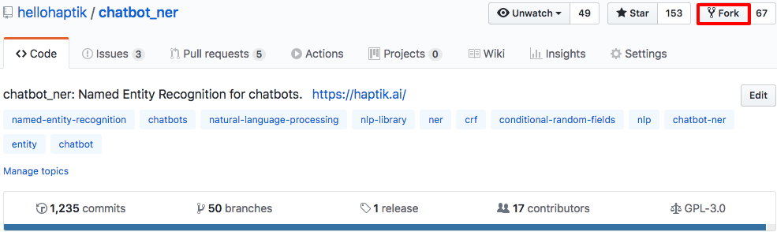
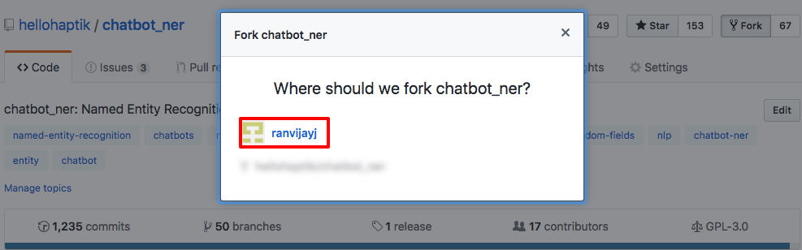
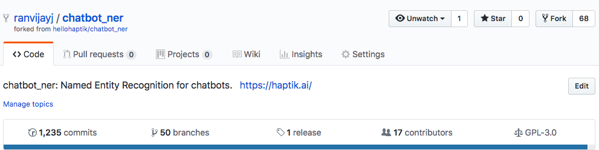
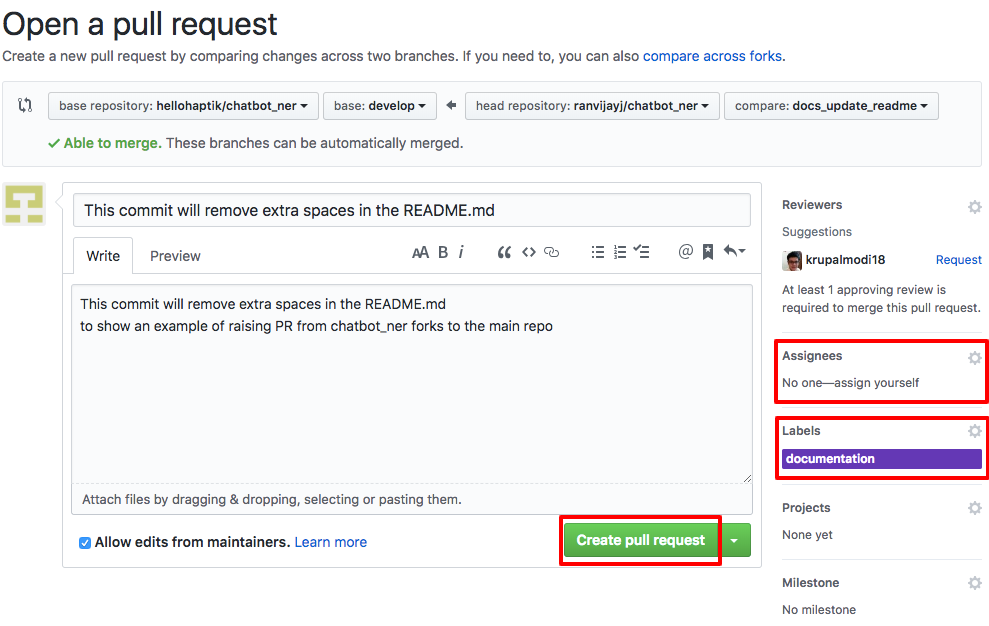
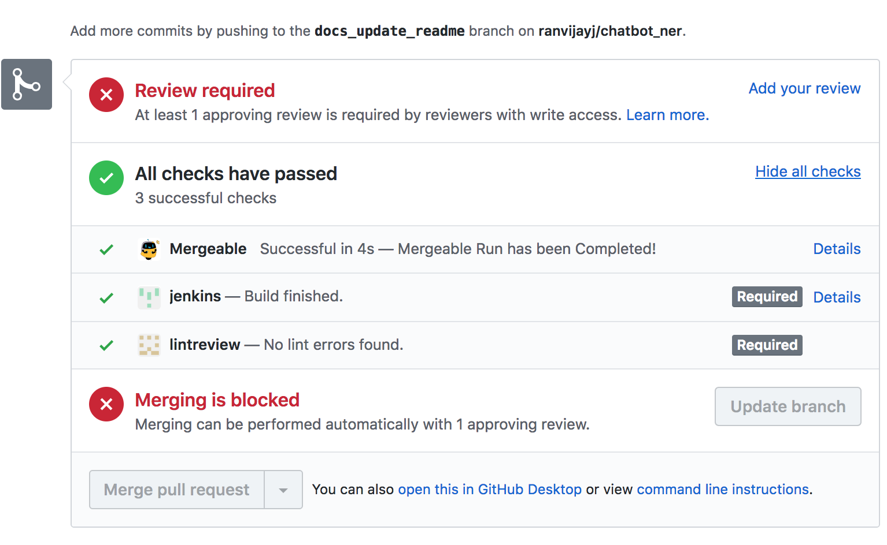

### Steps for writing code and Raise a PR:

1. Fork the repo by going to https://github.com/hellohaptik/chatbot_ner.git and doing the below:
   

   Above will open a prompt like this:
   

   Click on your username or organization you own. 

2. So, now you have forked the chatbot_ner repository as shown below:
   

   Lets see what you need to do next:

   1. Clone your new forked repository on your machine, for me it would be something like:
      git clone https://github.com/ranvijayj/chatbot_ner.git

   2. Remember, chatbot_ner follows GitFlow so all changes unless a hot fix go to develop first.

   3. Checkout to new branch
      git checkout -b branch_name

      Note: branch_name to be replace with the branch name you want. Ideally it should be the name of the feature and the change e.g.: language_support_hindi

   4. Make code changes. Follow pointer number 5 for code style docs.
      git commit -am"This change will add hindi language support etc. "
      git push origin branch_name

3. Create a pull request against the hellohaptik chatbot_ner repository. While creating the PR take care of the following things as shown below:
   

   Add Title, Description, Labels, and Milestone if you're working on any mentioned in the repository milestones. 

   **List of appropriate labels**:
   new-feature
   bug-fixes
   documentation
   enhancement
   needs-migration
   packages-updated
   miscellaneous

4. You're done. Just wait for the PR checks to pass as shown below:
    One of the admins will approve your PR and merge it. 

5. You can follow this link to checkout basic coding 
[guidelines](https://github.com/hellohaptik/chatbot_ner/tree/develop/docs/code_style_guide.md)
