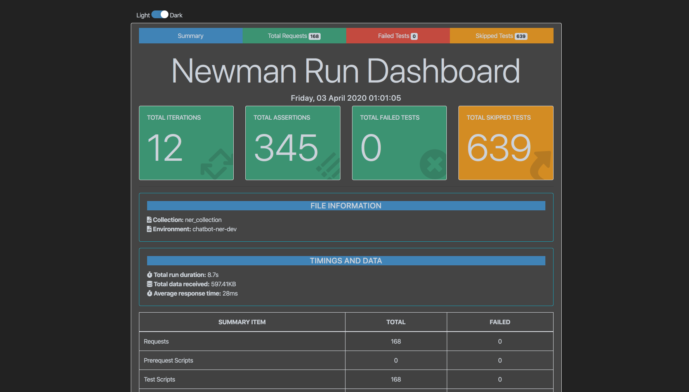

**Running the tests**

```
docker exec -it docker_chatbot-ner_1 python postman_tests/run_postman_tests.py
```

Or

```
docker exec -it docker_chatbot-ner_1 python postman_tests/run_postman_tests.py --html
```

The ```--html``` argument will generate a html report in ```postman_tests/newman_reports```

A shortcut for running the above is available. Just run ```./run_postman_tests.sh``` or ```./run_postman_tests.sh --html``` in the root directory.

**HTML Report**

The html report is a timestamped html file and a new one is generated everytime tests are run. This html file contains a graphical dashboard which can be used to see the status of running the tests, failures etc, and yes you can use dark mode as well ;-).



**Adding test data for new entities**

To add test data for a new entity create a new json file in postman_tests/data/entities/.

The format should follow the below structure:

```
[
    {
        "input": {
            "message": "The text sent in url",
            "entity_name": "Name of the entity e.g. time"
        },

        "expected": [
            {
                <Put your expected key and values here>
            }
        ]
    }
]
```

input contains the parameters that we pass as query parameters in the GET rquest. It must **mandatorily** contain two keys,
message and entity_name.

expected is an array of objects that we get in the response.

If you want to create a test case where the output of a request is expected to be null, then specify the test case as follows:

```
[
    {
        "input": {
            "message": "The text sent in url",
            "entity_name": "Name of the entity. If this entity uses ES indexing then the name should be prefixed by ner_ptest e.g. ner_ptest_restuarant"
        },

        "expected": [
            {
                "data": null
            }
        ]
    }
]
```

Add tests for the new entity using steps given below in this document and send a PR containing the new collection and data.


**Modifying test data of existing entities**

Modify the enitities data json file in postman_tests/data/entities and if required the tests as well using steps given below in this document and send a PR for the modifications.


**Adding new tests / Modifying existing ones**

Postman tests now use the new Chaijs based BDD syntax and they have deprecated the old one. So all existing tests have been translated to use the new syntax. 

Refer to the [postman documentation](https://learning.postman.com/docs/postman/scripts/test-scripts/) for how to use the new syntax for writing tests.

Use the below steps:

1. First import postman_tests/data/ner_collection.json into postman

2. After adding new tests or modifying existing ones, export the modified collection into ner_collection.json in postman_tests/data folder in ner.

3. Run the test suite using the process given in this Readme above to make sure all pass.

4. Send a PR containing the new ner_collection.json and data.


**Adding data to be indexed into ElasticSearch**

1. Add the csv file with a filename preceded by ner_ptest for the particular entity in postman_tests/data/elastic_search/, e.g. ner_ptest_restaurant.csv.

2. Make sure all the required data being used in the tests is present in the csv file and all tests are passing.

3. Send a PR.


**Future Roadmap**

1. Some test cases are failing for various entities and we are maintaining a list of the same. These will need to be integrated into the test-suite once fixed.
